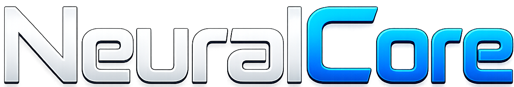

  

  <strong>⚠️ Actively Developed — Production Release Coming Soon</strong>

  

  
  
  
  

  
  

  
  
  
  

  
  
  

  
  

  
  
  

  
  
  
  
  

  
  
  

  
  
  
  

  

  

---

# NeuralCore

**NeuralCore** is a large-scale, production-grade AI infrastructure platform engineered from the ground up to serve as a complete foundation for modern AI systems. It unifies Retrieval-Augmented Generation, Agentic AI, Multi-Agent Orchestration, Knowledge Management, Model Integration, Fine-Tuning, and AI Platform infrastructure into a single, cohesive, modular architecture.

NeuralCore is not a wrapper. It is not a demo. It is not a thin abstraction over existing libraries. It is an enterprise-grade AI platform — purpose-built to power AI startups, SaaS products, enterprise knowledge systems, research environments, and next-generation AI applications at scale.

---

## The Vision

The AI infrastructure landscape is fragmented. Teams are stitching together dozens of disconnected libraries, managing brittle pipelines, and rebuilding the same foundational components over and over. NeuralCore exists to end that cycle.

The goal is singular: build the most complete, the most modular, and the most production-ready AI infrastructure platform available — one that any team can deploy, extend, and scale without compromise.

NeuralCore is designed to be the invisible backbone of AI products that matter.

---

## What NeuralCore Is Not

Before understanding what NeuralCore is, it is worth being precise about what it is not:

- It is not a LangChain wrapper or a LlamaIndex clone
- It is not a simple RAG demo or a chatbot boilerplate
- It is not tied to any single model provider or vector database
- It is not a research toy or a weekend project

NeuralCore is infrastructure. The kind that runs in production, handles enterprise tenants, meters usage, enforces compliance, and scales horizontally under real workloads.

---

## Core Philosophy

**Modularity above all.** Every subsystem in NeuralCore is an independent module. The retrieval layer does not know about the agent layer. The billing system does not know about the prompt engine. Everything is composable, replaceable, and independently testable.

**Provider agnosticism.** No vendor lock-in. NeuralCore supports eight LLM providers, six vector store backends, multiple embedding providers, and three billing processors. Swap any of them without touching your application logic.

**Performance by design.** The most computationally intensive operations — vector indexing, similarity computation, reranking, tokenization — are implemented in Rust and exposed via FFI. Python handles orchestration. Rust handles throughput.

**Enterprise from day one.** Multi-tenancy, role-based access control, audit logging, compliance controls, quota enforcement, and billing are not afterthoughts. They are core subsystems, built into the architecture from the beginning.

---

## Platform Capabilities

### Retrieval-Augmented Generation

NeuralCore contains a complete, production-grade RAG stack. Every stage of the retrieval pipeline is independently configurable and replaceable.

**Data Ingestion** supports over twenty-five enterprise data sources out of the box — PDF, DOCX, XLSX, CSV, JSON, XML, Markdown, HTML, websites, sitemaps, GitHub, GitLab, Bitbucket, Notion, Confluence, Slack, Discord, Jira, MySQL, PostgreSQL, MongoDB, email, YouTube, audio, and video. A unified loader factory handles source routing, and new loaders can be added without modifying the ingestion pipeline.

**Preprocessing** includes content cleaning, deduplication, language detection, metadata extraction, normalization, and PII detection — ensuring that every document entering the system is clean, structured, and safe before it is indexed.

**Chunking** supports eight distinct strategies: recursive, token-based, semantic, markdown-aware, code-aware, AST-based, hybrid, and custom. The right chunking strategy is often the difference between retrieval that works and retrieval that works at scale.

**Embedding** is handled through a provider-abstracted embedding layer supporting OpenAI, BGE, E5, Jina, Nomic, Sentence Transformers, and custom embedding models. Adding a new embedding model requires implementing a single interface — nothing else changes.

**Retrieval** supports seven retrieval modes: vector search, BM25, hybrid, metadata-filtered, graph-based, federated, and multimodal. Query rewriting is built in. The retrieval layer is fully composable — any combination of retrieval modes can be assembled into a pipeline.

**Reranking** adds a dedicated cross-encoder reranking stage with support for BGE rerankers, Jina rerankers, cross-encoder models, and hybrid reranking strategies. Reranking is the most underrated component in production RAG — NeuralCore treats it as a first-class citizen.

**Prompt Construction** is handled by a dedicated prompt engine responsible for context building, context compression, template management, and token optimization. The prompt engine ensures that every request to the model is assembled with precision, and that no tokens are wasted.

---

### Vector Store Infrastructure

NeuralCore supports six production vector store backends through a unified abstraction layer:

| Backend | Use Case |
|---|---|
| Qdrant | High-performance, production-scale vector search |
| Milvus | Billion-scale vector indexing |
| Weaviate | Semantic search with native graph capabilities |
| PGVector | PostgreSQL-native vector storage for existing database stacks |
| Elasticsearch | Hybrid BM25 and vector search at enterprise scale |
| FAISS | High-speed local and research workloads |

Switching backends requires a configuration change. No application code changes.

---

### Knowledge Graph and GraphRAG

NeuralCore contains a dedicated knowledge graph subsystem and a full GraphRAG implementation. Entities are extracted, linked, resolved, and stored as a structured graph. Relationships are extracted and scored. The graph is indexed, searchable, and traversable.

GraphRAG queries combine traditional vector retrieval with graph traversal — surfacing answers that require reasoning across connected facts, not just similarity matching. Entity resolution ensures that the same real-world entity referenced in different documents is understood as a single node in the knowledge graph.

The visualization layer exports graph data for external rendering and provides graph metrics for quality assessment.

---

### Agentic AI and Multi-Agent Orchestration

NeuralCore is designed for the agentic era of AI. The agent subsystem is not a thin wrapper over function calling — it is a full multi-agent runtime.

**Agent Types** include a Planner agent responsible for task decomposition, an Executor agent for action execution, a Retrieval agent for knowledge access, a Memory agent for persistent context management, a Research agent for deep information gathering, a Coding agent for code generation and analysis, and a Tool agent for external system interaction.

**Agent Runtime** provides a lifecycle manager, scheduler, checkpointing system, state manager, and event bus. Agents are long-lived, stateful, and recoverable. A crashed agent can resume from its last checkpoint. Agent state is fully serializable.

**Agent Communication** is handled through a dedicated messaging layer with routing, a broker system, protocol definitions, and typed communication channels. Agents communicate through structured messages, not raw strings.

**Agent-to-Agent Protocol (A2A)** is a first-class protocol in NeuralCore. Agents can discover each other through a registry, route messages through a transport layer, communicate directly, broadcast to groups, or queue messages for asynchronous processing. Security — including authentication and authorization between agents — is built into the A2A layer.

**Workflow Orchestration** allows complex multi-agent workflows to be defined, registered, and executed as reusable templates. Pre-built workflow templates cover standard RAG pipelines, agentic RAG, code assistant workflows, and research workflows. Custom workflows are fully supported.

---

### Memory Architecture

NeuralCore replaces naive chat history with a structured memory architecture:

**Short-Term Memory** holds the immediate context of an ongoing session — recent exchanges, active tool outputs, and in-progress reasoning chains.

**Long-Term Memory** persists information across sessions. Facts, preferences, and learned context survive conversation boundaries and are retrievable on demand.

**Semantic Memory** stores conceptual knowledge as embeddings — allowing memory recall through meaning, not just keyword matching.

**Episodic Memory** records experiences and events in a time-indexed structure — enabling agents to reason about what happened, when it happened, and what was learned.

**Session Memory** manages the full context of an active user session, including multi-turn conversation state, active agent contexts, and in-progress task state.

---

### Model Gateway

The model gateway is NeuralCore's provider abstraction layer. Every LLM interaction in the platform flows through the gateway. Supported providers include OpenAI, Anthropic, Google Gemini, DeepSeek, Mistral, Llama, and Ollama.

Adding a new model provider requires implementing the base provider interface. Nothing in the retrieval layer, agent layer, or application layer changes. The gateway handles routing, retries, rate limiting, and provider-specific API contract differences transparently.

---

### Model Context Protocol (MCP)

NeuralCore implements the Model Context Protocol — an emerging standard for structured, bidirectional communication between AI systems and external tools and resources. The MCP layer includes a client, a server, resource management, tool definitions, and transport handling. NeuralCore is ready for the MCP ecosystem as it matures.

---

### Tool Framework

Agents in NeuralCore operate through a structured tool framework. Every tool is registered, validated against a schema, and executed through a typed executor. Built-in tools include web search, retrieval, file reading, calculator utilities, and memory access. Custom tools can be registered without modifying the framework. Tool schemas ensure that agents receive structured, validated inputs and outputs.

---

### Fine-Tuning Pipeline

NeuralCore includes a complete fine-tuning pipeline for organizations that need to adapt foundation models to their specific domain.

**Dataset Management** covers generation, cleaning, validation, and format conversion. Supported formats include Alpaca, ShareGPT, OpenAI fine-tuning format, and custom schemas.

**Training** supports LoRA and QLoRA adapter training, with a full training job system including queuing, scheduling, and worker management.

**Evaluation** assesses fine-tuned models against defined benchmarks before export. The model registry tracks all trained artifacts.

---

### Distributed Training Infrastructure

For organizations training models from scratch or performing large-scale fine-tuning, NeuralCore provides distributed training infrastructure supporting DDP, FSDP, and DeepSpeed. Mixed precision training, gradient checkpointing, and advanced optimization strategies are built in. Experiment tracking and model checkpointing are handled automatically.

---

### Multi-Tenancy and Enterprise Security

NeuralCore is built for multi-tenant enterprise deployments from the ground up.

**Tenant Isolation** ensures that data, embeddings, vector indices, agent contexts, and memory are fully isolated between tenants. No tenant can access another tenant's data at any layer of the stack.

**Organization Management** supports hierarchical organizational structures with members, roles, and permissions. Fine-grained access control is enforced at the API level.

**Quota Enforcement** allows usage limits to be defined and enforced per tenant — covering API calls, storage, compute, and embedding generation.

**Compliance and Audit** controls ensure that every significant action in the platform is logged with full context — who performed it, when, from which tenant, and what the outcome was.

---

### Billing and Monetization

NeuralCore includes a complete billing system for organizations building commercial AI products on top of the platform.

**Plan and Subscription Management** supports tiered pricing with configurable feature flags and limits per plan.

**Usage Metering** tracks consumption at a granular level — API calls, tokens processed, embeddings generated, storage used — and feeds into billing calculations in real time.

**Payment Providers** include Stripe, PayPal, and Razorpay — covering global and regional payment requirements.

**Invoicing and Revenue Reporting** provide financial visibility through automated invoice generation, revenue reporting, and tax handling.

---

### Evaluation Framework

NeuralCore includes a dedicated evaluation system that treats quality measurement as infrastructure, not an afterthought.

Retrieval evaluation measures recall, precision, NDCG, and MRR across retrieval strategies. RAG evaluation measures faithfulness, answer relevance, context precision, and context recall. Reranking evaluation measures ranking quality improvements. Agent evaluation assesses task completion rates, tool use accuracy, and multi-step reasoning quality.

Benchmarks run on demand or on schedule. Reports are generated automatically. Metrics are tracked over time.

---

### Rust Performance Engine

The most computationally intensive components of NeuralCore are implemented in Rust and exposed to the Python runtime via FFI:

- Vector indexing with sub-millisecond query performance
- Similarity computation at scale
- Reranking acceleration for low-latency reranking pipelines
- High-throughput tokenization
- Lossless and lossy compression for vector data
- Intelligent caching for repeated computation

The Rust engine is compiled as a native library and loaded by the Python backend at startup. The interface is transparent — Python callers use standard function calls.

---

### Background Processing

Long-running operations in NeuralCore — document ingestion, embedding generation, reranking, retrieval pre-computation — are executed asynchronously through a Celery-based task queue backed by Redis. Workers are independently scalable. Task scheduling supports both immediate and time-delayed execution.

---

### Frontend Platform

NeuralCore ships with a full-featured frontend application built with Next.js 14 and React, providing a professional management interface for every platform capability.

The **Dashboard** provides a real-time overview of platform health, usage metrics, cost tracking, and activity across all projects.

The **Knowledge Base Manager** provides full visibility into ingested documents, chunk structures, embedding quality, and retrieval configuration. Every chunk is inspectable. Every embedding is visualizable.

The **Retrieval Debugger** is the most powerful diagnostic tool in the platform — allowing engineers to inspect exactly how a query is processed, which chunks are retrieved, how they are scored, and how reranking changes the final result.

The **Agent Interface** provides a visual environment for configuring, running, and monitoring agents. Agent logs are streamed in real time. Agent configuration is fully editable through the UI.

The **Monitoring Dashboard** exposes logs, distributed traces, and alerts in a unified interface, with deep integration into Prometheus and Grafana for metrics and Loki for log aggregation.

The **Vector Store Manager** provides per-backend management interfaces for Qdrant, Milvus, and PGVector — exposing index health, collection statistics, and query performance metrics.

---

### Plugin Ecosystem

NeuralCore is designed to be extended. The plugin system provides a registry, manager, validator, and marketplace infrastructure for first-party and third-party plugins. Built-in plugins cover GitHub, Jira, Notion, and Slack. Custom plugins implement a defined interface and are loaded dynamically at runtime.

---

### SDK Coverage

NeuralCore exposes its full API surface through native SDKs in six languages:

| Language | Status |
|---|---|
| Python | Core SDK |
| TypeScript | Full type coverage |
| JavaScript | Browser and Node.js |
| Go | High-performance server clients |
| Rust | Native integration |
| Java | Enterprise JVM environments |

Every SDK implements the same resource model — agents, projects, knowledge bases, retrieval, embeddings, memory, workflows, datasets, and vector stores — ensuring a consistent developer experience regardless of language.

---

### Infrastructure and Deployment

NeuralCore is designed for modern cloud-native deployment.

**Containerization** — every service has a dedicated, optimized Dockerfile. The Rust engine, API server, frontend, and background workers are independently containerized.

**Docker Compose** configurations are provided for local development and production single-node deployments.

**Kubernetes** manifests cover all platform services including the API, workers, PostgreSQL, Redis, and Qdrant, with namespace isolation, ingress configuration, and resource management.

**Terraform** modules handle cloud infrastructure provisioning.

**Observability** is built in through Prometheus metric collection, Grafana dashboards, and Loki log aggregation. Distributed tracing is implemented at the API layer. Health checks are exposed for every service.

---

## Target Deployment Contexts

NeuralCore is designed to serve a broad range of deployment scenarios:

- AI startups building intelligent products and needing a complete infrastructure foundation
- SaaS companies adding AI-powered features to existing products
- Enterprise organizations building internal knowledge platforms and AI copilots
- Research teams requiring reproducible, scalable retrieval and evaluation infrastructure
- Organizations building code assistants, document intelligence systems, or research automation tools
- Platform teams building internal AI infrastructure for developer-facing products

---

## Supported Providers at a Glance

| Category | Supported Options |
|---|---|
| LLM Providers | OpenAI, Anthropic, Google Gemini, DeepSeek, Mistral, Llama, Ollama |
| Embedding Models | OpenAI, BGE, E5, Jina, Nomic, Sentence Transformers, Custom |
| Vector Stores | Qdrant, Milvus, Weaviate, PGVector, Elasticsearch, FAISS |
| Rerankers | Cross-Encoder, BGE, Jina, Hybrid |
| Payment Processors | Stripe, PayPal, Razorpay |
| Data Sources | 25+ enterprise connectors |

---

## Documentation

Full documentation covers every subsystem in depth:

- [Architecture Overview](docs/architecture.md)
- [API Reference](docs/api.md)
- [Ingestion Guide](docs/ingestion.md)
- [Retrieval Guide](docs/retrieval.md)
- [Agent System](docs/agents.md)
- [Memory Architecture](docs/memory.md)
- [Embedding Configuration](docs/embeddings.md)
- [SDK Reference](docs/sdk.md)
- [Security Model](docs/security.md)
- [Deployment Guide](docs/deployment.md)

---

## Roadmap

NeuralCore is under active development. The architecture is designed with extensibility as a core constraint — every subsystem is built to accommodate capabilities that do not yet exist. The long-term vision includes real-time streaming retrieval, native multimodal reasoning, autonomous agent networks, federated knowledge infrastructure, and AI operating system primitives.

The ROADMAP document tracks the specific milestones and timelines for upcoming releases.

---

## License

Copyright (c) 2026 Sambhav Dwivedi. All Rights Reserved.

This software and its source code are proprietary. No part of this codebase may be reproduced, distributed, modified, or used in any form without the express written permission of the author. Unauthorized use, copying, or distribution of this software is strictly prohibited.

See the [LICENSE](LICENSE) file for full terms.

---

## About the Developer

NeuralCore is designed and built by **Sambhav Dwivedi** — an AI engineer focused on unifying retrieval, memory, reasoning, agents, and intelligence into a unified AI infrastructure platform.

- Website: [Sambhav Dwivedi](https://www.sambhavdwivedi.in)
- LinkedIn: [Sambhav Dwivedi](https://www.linkedin.com/in/sambhavdwivedi)

---

  Built with precision. Designed for scale. Made for the future.

